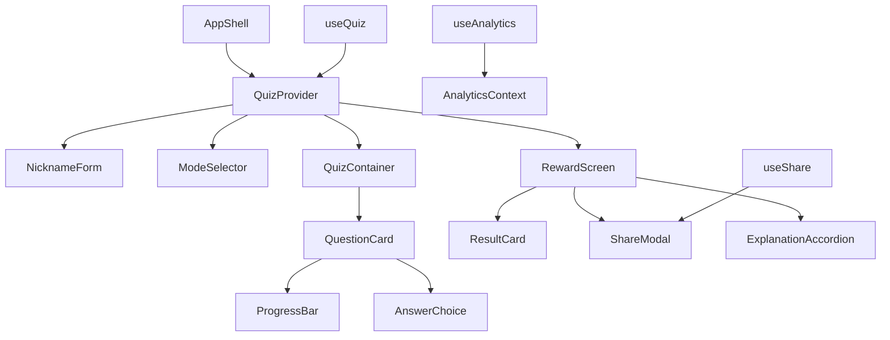

# 컴포넌트 아키텍처 설계

**문서 버전:** 1.0  
**작성일:** 2025-07-11  
**작성자:** AI Development Team  
**참조:** PRD v5.2 섹션 6, 와이어프레임, 스타일 가이드

---

## 🏗️ 아키텍처 개요

### 설계 원칙
1. **단일 책임 원칙**: 각 컴포넌트는 하나의 명확한 역할
2. **재사용성**: 공통 UI 컴포넌트의 높은 재사용성
3. **확장성**: 새로운 기능 추가 시 기존 구조 변경 최소화
4. **테스트 용이성**: 각 컴포넌트의 독립적 테스트 가능

### 기술 스택 재확인
- **React 18**: 함수형 컴포넌트 + Hooks
- **TypeScript 5**: 엄격한 타입 검사
- **Tailwind CSS**: 유틸리티 퍼스트 스타일링
- **Radix UI**: 접근성 기반 헤드리스 컴포넌트
- **Framer Motion**: 120ms 기준 애니메이션

---

## 📂 디렉토리 구조

```
src/
├── components/           # 컴포넌트
│   ├── ui/              # shadcn/ui 기본 컴포넌트
│   │   ├── button.tsx
│   │   ├── card.tsx
│   │   ├── input.tsx
│   │   ├── modal.tsx
│   │   ├── progress.tsx
│   │   └── accordion.tsx
│   ├── layout/          # 레이아웃 컴포넌트
│   │   ├── AppShell.tsx
│   │   ├── Header.tsx
│   │   ├── AdBanner.tsx
│   │   └── Container.tsx
│   ├── quiz/            # 퀴즈 관련 컴포넌트
│   │   ├── QuestionCard.tsx
│   │   ├── ProgressBar.tsx
│   │   ├── AnswerChoice.tsx
│   │   └── QuizContainer.tsx
│   ├── results/         # 결과 화면 컴포넌트
│   │   ├── RewardScreen.tsx
│   │   ├── ResultCard.tsx
│   │   ├── ExplanationAccordion.tsx
│   │   └── ShareModal.tsx
│   ├── forms/           # 입력 폼 컴포넌트
│   │   ├── NicknameForm.tsx
│   │   ├── ModeSelector.tsx
│   │   └── IntegratedModeSlider.tsx
│   └── shared/          # 공통 컴포넌트
│       ├── LoadingSpinner.tsx
│       ├── ErrorBoundary.tsx
│       ├── Toast.tsx
│       └── AnimationWrapper.tsx
├── hooks/               # 커스텀 훅
│   ├── useQuiz.ts
│   ├── useShare.ts
│   ├── useLocalStorage.ts
│   ├── useAnalytics.ts
│   └── useMediaQuery.ts
├── contexts/            # 전역 상태 컨텍스트
│   ├── QuizContext.tsx
│   ├── AnalyticsContext.tsx
│   └── ThemeContext.tsx
├── types/               # TypeScript 타입 정의
│   ├── quiz.ts
│   ├── analytics.ts
│   └── api.ts
├── lib/                 # 유틸리티 라이브러리
│   ├── utils.ts
│   ├── analytics.ts
│   ├── validation.ts
│   └── constants.ts
├── data/                # 데이터 파일
│   ├── questions.ko.json
│   ├── questions.en.json
│   ├── questions.es.json
│   └── i18n/
│       ├── ko.json
│       ├── en.json
│       └── es.json
└── assets/              # 정적 자산
    ├── images/
    │   ├── faces/
    │   ├── eyes/
    │   └── share/
    └── icons/
```

---

## 🧩 핵심 컴포넌트 설계

### 1. AppShell (최상위 레이아웃)

```typescript
// src/components/layout/AppShell.tsx
interface AppShellProps {
  children: React.ReactNode;
}

export const AppShell: React.FC<AppShellProps> = ({ children }) => {
  return (
    <div className="min-h-screen bg-background-light">
      <AdBanner />
      <Container>
        {children}
      </Container>
      <Toast />
    </div>
  );
};
```

### 2. QuestionCard (퀴즈 핵심 컴포넌트)

```typescript
// src/components/quiz/QuestionCard.tsx
interface QuestionCardProps {
  question: EmotionQuestion;
  onAnswer: (selectedAnswer: string) => void;
  currentQuestion: number;
  totalQuestions: number;
  disabled?: boolean;
}

export const QuestionCard: React.FC<QuestionCardProps> = ({
  question,
  onAnswer,
  currentQuestion,
  totalQuestions,
  disabled = false
}) => {
  const [selectedAnswer, setSelectedAnswer] = useState<string | null>(null);
  const [showResult, setShowResult] = useState(false);

  const handleAnswerSelect = (answer: string) => {
    if (disabled || selectedAnswer) return;
    
    setSelectedAnswer(answer);
    setShowResult(true);
    
    // 120ms 후 다음 문제로 진행
    setTimeout(() => {
      onAnswer(answer);
    }, 120);
  };

  return (
    <div className="space-y-6">
      {/* 진행률 바 */}
      <ProgressBar current={currentQuestion} total={totalQuestions} />
      
      {/* 문제 이미지/텍스트 */}
      <div className="flex justify-center">
        {question.type === 'face2text' || question.type === 'eyes2text' ? (
          
        ) : (
          <div className="text-2xl font-bold text-center p-8">
            {question.emotionKey}
          </div>
        )}
      </div>

      {/* 문제 텍스트 */}
      <h2 className="text-lg font-medium text-center text-gray-700">
        {question.type === 'text2face' ? 
          '이 감정을 가장 잘 표현한 얼굴은?' : 
          '이 감정은 무엇일까요?'
        }
      </h2>

      {/* 4지선다 */}
      <div className="space-y-3">
        {question.choices.map((choice, index) => (
          <AnswerChoice
            key={index}
            choice={choice}
            index={index}
            isSelected={selectedAnswer === choice.id}
            isCorrect={showResult && choice.id === question.correctAnswer}
            isWrong={showResult && selectedAnswer === choice.id && choice.id !== question.correctAnswer}
            onClick={() => handleAnswerSelect(choice.id)}
            disabled={disabled || showResult}
          />
        ))}
      </div>
    </div>
  );
};
```

### 3. RewardScreen (통합 리워드 화면)

```typescript
// src/components/results/RewardScreen.tsx
interface RewardScreenProps {
  score: number;
  totalQuestions: number;
  grade: string;
  nickname: string;
  wrongAnswers: WrongAnswer[];
  onRestart: () => void;
  onShare: () => void;
}

export const RewardScreen: React.FC<RewardScreenProps> = ({
  score,
  totalQuestions,
  grade,
  nickname,
  wrongAnswers,
  onRestart,
  onShare
}) => {
  return (
    <div className="space-y-6">
      {/* 결과 카드 */}
      <ResultCard 
        score={score}
        totalQuestions={totalQuestions}
        grade={grade}
        nickname={nickname}
      />
      
      {/* 고정 공유 버튼 */}
      <div className="sticky top-4 z-10">
        <Button 
          onClick={onShare}
          className="btn-primary"
          aria-label="결과 공유하기"
        >
          📤 친구에게 도전 보내기
        </Button>
      </div>

      {/* 오답 해설 */}
      {wrongAnswers.length > 0 && (
        <ExplanationAccordion wrongAnswers={wrongAnswers} />
      )}

      {/* 재시작 버튼 */}
      <Button 
        onClick={onRestart}
        variant="secondary"
        className="w-full"
      >
        🔄 다시 도전하기
      </Button>
    </div>
  );
};
```

---

## 🔗 상태 관리 구조

### 1. QuizContext (퀴즈 전역 상태)

```typescript
// src/contexts/QuizContext.tsx
interface QuizState {
  // 사용자 정보
  nickname: string;
  
  // 퀴즈 설정
  mode: 'standard' | 'integrated';
  customRatios?: {
    face2text: number;
    text2face: number;
    eyes2text: number;
  };
  
  // 진행 상태
  currentQuestion: number;
  questions: EmotionQuestion[];
  answers: UserAnswer[];
  
  // 결과
  score: number;
  grade: string;
  wrongAnswers: WrongAnswer[];
  
  // UI 상태
  isLoading: boolean;
  error: string | null;
}

type QuizAction = 
  | { type: 'SET_NICKNAME'; payload: string }
  | { type: 'SET_MODE'; payload: QuizState['mode'] }
  | { type: 'LOAD_QUESTIONS'; payload: EmotionQuestion[] }
  | { type: 'ANSWER_QUESTION'; payload: UserAnswer }
  | { type: 'CALCULATE_RESULT' }
  | { type: 'RESET_QUIZ' }
  | { type: 'SET_LOADING'; payload: boolean }
  | { type: 'SET_ERROR'; payload: string | null };

const quizReducer = (state: QuizState, action: QuizAction): QuizState => {
  switch (action.type) {
    case 'SET_NICKNAME':
      return { ...state, nickname: action.payload };
    
    case 'ANSWER_QUESTION':
      const newAnswers = [...state.answers, action.payload];
      return {
        ...state,
        answers: newAnswers,
        currentQuestion: state.currentQuestion + 1
      };
    
    case 'CALCULATE_RESULT':
      const score = calculateScore(state.answers, state.questions);
      const grade = getGrade(score);
      const wrongAnswers = getWrongAnswers(state.answers, state.questions);
      
      return {
        ...state,
        score,
        grade,
        wrongAnswers
      };
    
    default:
      return state;
  }
};
```

### 2. useQuiz 훅

```typescript
// src/hooks/useQuiz.ts
export const useQuiz = () => {
  const context = useContext(QuizContext);
  if (!context) {
    throw new Error('useQuiz must be used within QuizProvider');
  }

  const { state, dispatch } = context;

  // 문제 로딩
  const loadQuestions = useCallback(async (mode: QuizMode, customRatios?: CustomRatios) => {
    dispatch({ type: 'SET_LOADING', payload: true });
    
    try {
      const allQuestions = await import('../data/questions.ko.json');
      const selectedQuestions = selectQuestions(allQuestions, mode, customRatios);
      const shuffledQuestions = shuffleArray(selectedQuestions);
      
      dispatch({ type: 'LOAD_QUESTIONS', payload: shuffledQuestions });
    } catch (error) {
      dispatch({ type: 'SET_ERROR', payload: '문제를 불러오는데 실패했습니다.' });
    } finally {
      dispatch({ type: 'SET_LOADING', payload: false });
    }
  }, [dispatch]);

  // 답변 제출
  const submitAnswer = useCallback((questionId: string, selectedAnswer: string) => {
    const question = state.questions[state.currentQuestion];
    const isCorrect = selectedAnswer === question.correctAnswer;
    
    dispatch({
      type: 'ANSWER_QUESTION',
      payload: {
        questionId,
        selectedAnswer,
        isCorrect,
        timeSpent: Date.now() // 실제로는 시작 시간 기록 필요
      }
    });

    // 마지막 문제면 결과 계산
    if (state.currentQuestion === state.questions.length - 1) {
      setTimeout(() => {
        dispatch({ type: 'CALCULATE_RESULT' });
      }, 120);
    }
  }, [state.currentQuestion, state.questions, dispatch]);

  return {
    ...state,
    loadQuestions,
    submitAnswer,
    resetQuiz: () => dispatch({ type: 'RESET_QUIZ' })
  };
};
```

---

## 🎭 컴포넌트 간 데이터 흐름



---

## 🔧 유틸리티 함수

### 1. 문제 선택 로직

```typescript
// src/lib/questionSelection.ts
export const selectQuestions = (
  allQuestions: EmotionQuestion[],
  mode: QuizMode,
  customRatios?: CustomRatios
): EmotionQuestion[] => {
  if (mode === 'standard') {
    return [
      ...getRandomQuestions(allQuestions, 'face2text', 4),
      ...getRandomQuestions(allQuestions, 'text2face', 3),
      ...getRandomQuestions(allQuestions, 'eyes2text', 3)
    ];
  } else if (mode === 'integrated' && customRatios) {
    const total = 10;
    return [
      ...getRandomQuestions(allQuestions, 'face2text', Math.round(total * customRatios.face2text)),
      ...getRandomQuestions(allQuestions, 'text2face', Math.round(total * customRatios.text2face)),
      ...getRandomQuestions(allQuestions, 'eyes2text', Math.round(total * customRatios.eyes2text))
    ];
  }
  
  throw new Error('Invalid quiz mode or missing custom ratios');
};

const getRandomQuestions = (
  questions: EmotionQuestion[],
  type: QuestionType,
  count: number
): EmotionQuestion[] => {
  const filtered = questions.filter(q => q.type === type);
  return shuffleArray(filtered).slice(0, count);
};
```

### 2. 점수 계산

```typescript
// src/lib/scoring.ts
export const calculateScore = (answers: UserAnswer[], questions: EmotionQuestion[]): number => {
  const correctAnswers = answers.filter(answer => answer.isCorrect).length;
  return Math.round((correctAnswers / questions.length) * 10);
};

export const getGrade = (score: number): string => {
  if (score >= 9) return '감정 탐정 마스터';
  if (score >= 6) return '감정 탐정 전문가';
  if (score >= 3) return '감정 탐정 초보자';
  return '감정 탐정 견습생';
};
```

---

## 🧪 컴포넌트 테스트 전략

### 1. 단위 테스트 (Vitest)

```typescript
// src/components/quiz/__tests__/QuestionCard.test.tsx
describe('QuestionCard', () => {
  it('renders question with image for face2text type', () => {
    const mockQuestion: EmotionQuestion = {
      id: '1',
      type: 'face2text',
      image: '/test-image.jpg',
      choices: [/* ... */],
      correctAnswer: 'happy'
    };

    render(
      <QuestionCard 
        question={mockQuestion}
        onAnswer={jest.fn()}
        currentQuestion={1}
        totalQuestions={10}
      />
    );

    expect(screen.getByRole('img')).toBeInTheDocument();
  });

  it('calls onAnswer after 120ms when answer is selected', async () => {
    const mockOnAnswer = jest.fn();
    // ... 테스트 구현
  });
});
```

### 2. 통합 테스트

```typescript
// src/__tests__/quiz-flow.test.tsx
describe('Quiz Flow Integration', () => {
  it('completes full quiz flow from nickname to results', async () => {
    render(
      <QuizProvider>
        <App />
      </QuizProvider>
    );

    // 닉네임 입력
    fireEvent.change(screen.getByPlaceholderText('예: 김감정'), {
      target: { value: '테스터' }
    });
    
    // ... 전체 플로우 테스트
  });
});
```

---

## 📊 성능 최적화 전략

### 1. 코드 스플리팅

```typescript
// src/App.tsx
const NicknameForm = lazy(() => import('./components/forms/NicknameForm'));
const QuizContainer = lazy(() => import('./components/quiz/QuizContainer'));
const RewardScreen = lazy(() => import('./components/results/RewardScreen'));

// 라우팅에서 Suspense 사용
<Suspense fallback={<LoadingSpinner />}>
  <Routes>
    <Route path="/" element={<NicknameForm />} />
    <Route path="/quiz" element={<QuizContainer />} />
    <Route path="/results" element={<RewardScreen />} />
  </Routes>
</Suspense>
```

### 2. 메모이제이션

```typescript
// 무거운 계산 결과 캐싱
const QuestionCard = React.memo(({ question, ...props }) => {
  const processedChoices = useMemo(
    () => shuffleArray(question.choices),
    [question.id]
  );

  return (
    // ... 컴포넌트 렌더링
  );
});
```

---

## 🔍 디버깅 및 개발 도구

### 1. React DevTools 지원

```typescript
// src/components/shared/DevTools.tsx
export const DevTools = () => {
  if (process.env.NODE_ENV !== 'development') return null;
  
  return (
    <div className="fixed bottom-4 right-4 bg-black text-white p-2 rounded">
      <details>
        <summary>Debug Info</summary>
        <QuizStateDebugger />
      </details>
    </div>
  );
};
```

### 2. 에러 경계

```typescript
// src/components/shared/ErrorBoundary.tsx
export const ErrorBoundary: React.FC<{ children: React.ReactNode }> = ({ children }) => {
  return (
    <ErrorBoundaryComponent
      fallback={({ error, resetError }) => (
        <div className="p-8 text-center">
          <h2>문제가 발생했습니다</h2>
          <p>{error.message}</p>
          <Button onClick={resetError}>다시 시도</Button>
        </div>
      )}
    >
      {children}
    </ErrorBoundaryComponent>
  );
};
```

---

**다음 단계**: STEP 2 완료 검증 및 STEP 3 준비 