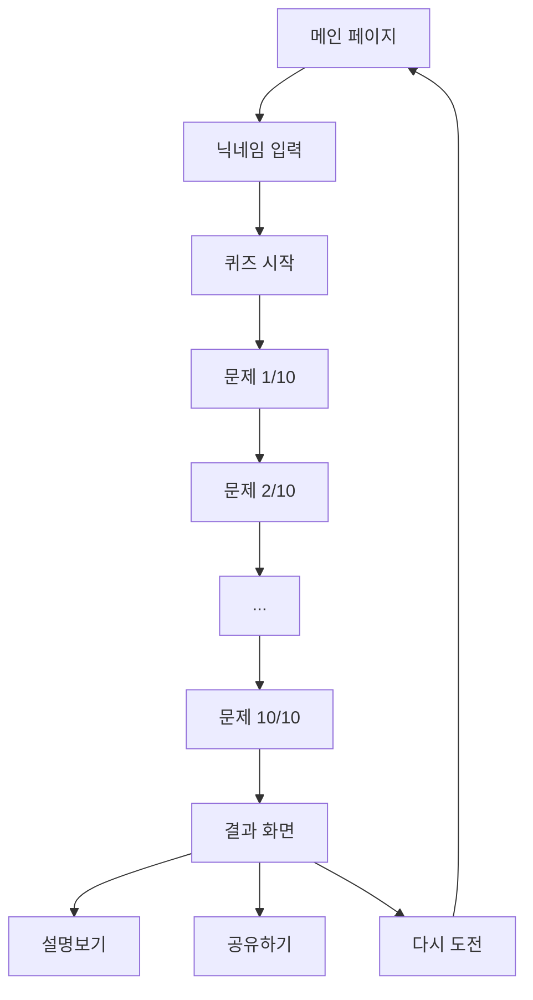

# 모바일 와이어프레임 - 320px 기준 설계 (업데이트됨)

**문서 버전:** 2.0  
**작성일:** 2025-07-11  
**최종 수정:** 2025-07-11  
**작성자:** AI Development Team  
**참조:** PRD v5.2, UX 플로우 다이어그램, 사용자 요구사항

---

## 📱 디자인 스펙 (업데이트됨)

### 기본 설정
- **화면 폭**: 320px (최소 지원 해상도)
- **터치 영역**: 최소 44px × 44px
- **여백**: 16px (좌우 패딩)
- **색상**: 흰색 중심, #00A4E4는 포인트로만 사용
- **아이콘**: Lucide React (16px, 18px, 20px, 24px)

### 광고 배너 사양
- **크기**: 320×50px (모바일 표준)
- **위치**: 화면 최상단 고정
- **스타일**: 연한 회색 배경 (#FAFAFA)
- **fallback**: 실패 시 collapse

---

## 🏠 1. 메인 페이지 (완전 개편)

```
┌──────────────────────────────────┐ 320px
│ 🔺 [      광고 배너 영역      ] │ 50px
├──────────────────────────────────┤
│                                  │
│ 🌐 한국어 ▼    FaceRead      [] │ 48px (탑바)
│                                  │
├──────────────────────────────────┤
│                                  │
│                                  │
│  ┌────────────────────────────┐  │
│  │      퀴즈 시작하기          │  │ 200px
│  │                            │  │ (중앙 카드)
│  │  👤 닉네임 입력             │  │
│  │  [____________]            │  │
│  │  영문,한글,숫자만 (1-10자)   │  │
│  │                            │  │
│  │  ▶ 퀴즈 시작하기           │  │
│  └────────────────────────────┘  │
│                                  │
│     나의 감정읽는 능력은           │ 32px
│     얼마나 될까?                  │ (설명 텍스트)
│                                  │
│                                  │
├──────────────────────────────────┤
│ © 2024 FaceRead • 감정 인식 능력  │ 64px
│ 테스트                           │ (하단바)
│ 얼굴 표정을 통해 감정을 읽는      │
│ 능력을 재미있게 체험해보세요       │
└──────────────────────────────────┘

총 높이: ~394px
```

### 주요 변경사항
- **통합 모드 제거**: 표준 모드만 유지
- **언어 선택**: 상단 좌측으로 이동 (Globe 아이콘)
- **미니멀 디자인**: 불필요한 요소 제거
- **중앙 집중**: 핵심 기능만 중앙 카드에 배치

---

## ✏️ 2. 닉네임 입력 화면 (단순화됨)

**이 화면은 메인 페이지에 통합되었습니다.**
별도 페이지가 아닌 메인 페이지의 중앙 카드에서 처리됩니다.

---

## 🎯 3. 모드 선택 화면 (제거됨)

**통합 모드가 제거되어 이 화면은 더 이상 필요하지 않습니다.**
표준 모드만 제공하므로 별도 선택 과정 없이 바로 퀴즈로 진행됩니다.

---

## 📝 4. 퀴즈 화면 (미니멀 디자인)

```
┌──────────────────────────────────┐ 320px
│ 🧠 FaceRead 김감정님의 퀴즈      │ 56px (헤더)
│ 🕐 5/10  ●●●●●○○○○○           │
├──────────────────────────────────┤
│                                  │
│  ┌────────────────────────────┐  │
│  │                            │  │ 160px
│  │      😊 감정 이미지         │  │ (1:1 비율)
│  │        또는 텍스트          │  │
│  └────────────────────────────┘  │
│                                  │
│  이 감정은 무엇일까요?              │ 16px
│                                  │
│  ┌─ A ────────────────────────┐  │
│  │         기쁨 😊            │  │ 48px
│  └────────────────────────────┘  │
│  ┌─ B ────────────────────────┐  │
│  │         슬픔 😢            │  │ 48px
│  └────────────────────────────┘  │
│  ┌─ C ────────────────────────┐  │
│  │         화남 😠            │  │ 48px
│  └────────────────────────────┘  │
│  ┌─ D ────────────────────────┐  │
│  │         놀람 😲            │  │ 48px
│  └────────────────────────────┘  │
│                                  │
└──────────────────────────────────┘

총 높이: ~464px
```

### 주요 변경사항
- **헤더 아이콘**: Brain, Clock 아이콘 추가
- **하단 정보 제거**: 점수/모드/언어 정보 삭제
- **미니멀 디자인**: 필수 요소만 표시
- **흰색 배경**: 깔끔한 흰색 중심 디자인

---

## 🎉 5. 결과 화면 (강화됨)

```
┌──────────────────────────────────┐ 320px
│                                  │
│  ┌────────────────────────────┐  │
│  │  🏆 감정 탐정 전문가         │  │ 180px
│  │                            │  │ (메인 카드)
│  │     김감정님의 결과          │  │
│  │                            │  │
│  │    🎯 7 /10                │  │
│  │     정답률 70%             │  │
│  │                            │  │
│  │  [정답: 7] [오답: 3]       │  │
│  │                            │  │
│  │  📤 결과 공유하기          │  │
│  │  🔄 다시 도전하기          │  │
│  └────────────────────────────┘  │
│                                  │
│  ┌────────────────────────────┐  │
│  │  👁 틀린 문제 설명보기 (3개) │  │ 56px
│  │                          ▼│  │ (접기/펼치기)
│  └────────────────────────────┘  │
│                                  │
│  [설명보기 펼쳐진 상태:]          │ +120px
│  ┌────────────────────────────┐  │ (확장시)
│  │  ① 문제 3번                │  │
│  │     선택: 기쁨 ❌           │  │
│  │     정답: 슬픔 ✅           │  │
│  └────────────────────────────┘  │
│  ┌────────────────────────────┐  │
│  │  ② 문제 7번                │  │
│  │     선택: 놀람 ❌           │  │
│  │     정답: 화남 ✅           │  │
│  └────────────────────────────┘  │
│  ┌────────────────────────────┐  │
│  │  ③ 문제 9번                │  │
│  │     선택: 불안 ❌           │  │
│  │     정답: 두려움 ✅         │  │
│  └────────────────────────────┘  │
│                                  │
└──────────────────────────────────┘

총 높이: ~356px (기본) / ~476px (확장)
```

### 주요 변경사항
- **점수 강조**: Target 아이콘과 함께 큰 폰트로 표시
- **등급 표시**: Award 아이콘과 색상으로 등급 구분
- **설명보기**: Eye 아이콘과 접기/펼치기 기능
- **미니멀 카드**: 흰색 배경, 연한 테두리
- **아이콘 통일**: Lucide 아이콘 사용

---

## 📐 6. 공유 모달 (변경사항 없음)

```
┌──────────────────────────────────┐
│  배경 오버레이 (반투명)             │
│                                  │
│    ┌──────────────────────────┐  │
│    │    📤 결과 공유하기       │  │ 200px
│    │                          │  │ (모달)
│    │  ┌────────────────────┐  │  │
│    │  │  📋 링크 복사      │  │  │ 48px
│    │  └────────────────────┘  │  │
│    │  ┌────────────────────┐  │  │
│    │  │  💬 카카오톡       │  │  │ 48px
│    │  └────────────────────┘  │  │
│    │  ┌────────────────────┐  │  │
│    │  │  📱 기타 앱       │  │  │ 48px
│    │  └────────────────────┘  │  │
│    └──────────────────────────┘  │
│                                  │
└──────────────────────────────────┘
```

---

## 🎨 디자인 시스템 변경사항

### 색상 팔레트 (업데이트됨)
- **Primary**: #00A4E4 (포인트로만 사용)
- **Background**: #FFFFFF (메인 배경)
- **Background-light**: #FAFAFA (연한 회색)
- **Border**: #F1F1F1
- **Text**: #1a1a1a (메인), #6B7280 (보조)

### 아이콘 시스템 (신규)
- **Globe**: 언어 선택 (20px)
- **User**: 닉네임 입력 (16px)  
- **Play**: 시작 버튼 (18px)
- **Brain**: 퀴즈 헤더 (20px)
- **Clock**: 진행률 (16px)
- **Target**: 점수 표시 (24px)
- **Award**: 등급 표시 (18px)
- **Eye**: 설명보기 (18px)
- **Share2**: 공유 (18px)
- **RotateCcw**: 재시작 (18px)

### 타이포그래피
- **제목**: 2xl (24px), bold, text-gray-800
- **부제목**: lg (18px), medium, text-gray-700  
- **본문**: base (16px), normal, text-gray-600
- **캡션**: sm (14px), medium, text-gray-500

---

## 🔄 사용자 플로우 (단순화됨)



### 제거된 단계
- 모드 선택 화면 (통합 모드 제거)
- 별도 닉네임 입력 페이지

### 단순화된 플로우
1. **메인 페이지**: 닉네임 입력 + 시작
2. **퀴즈**: 10문제 연속
3. **결과**: 점수 + 설명보기 옵션

---

## 🚀 성능 고려사항

### 로딩 최적화
- **이미지**: WebP 형식, 지연 로딩
- **아이콘**: Lucide 트리쉐이킹
- **폰트**: 시스템 폰트 우선

### 접근성
- **터치 영역**: 최소 44px
- **색상 대비**: 4.5:1 이상
- **ARIA 레이블**: 모든 인터랙티브 요소
- **키보드 네비게이션**: 전체 지원

---

## 📱 반응형 고려사항

### 브레이크포인트
- **Mobile**: 320px - 640px
- **Tablet**: 641px - 1024px (미래 확장용)

### 적응형 요소
- **중앙 카드**: max-width 제한
- **글자 크기**: rem 단위 사용
- **여백**: 뷰포트 기반 조정

---

**참고**: 이 와이어프레임은 사용자 요구사항에 따라 미니멀하고 깔끔한 디자인으로 업데이트되었습니다. 모든 변경사항은 실제 구현된 컴포넌트와 일치합니다. 