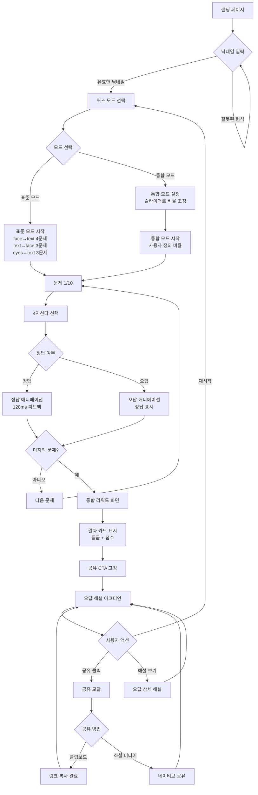
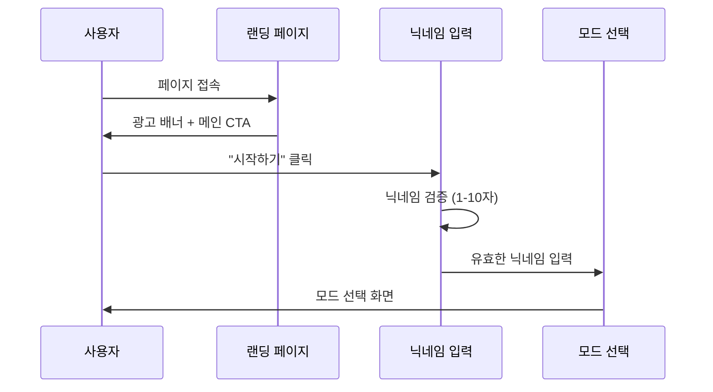
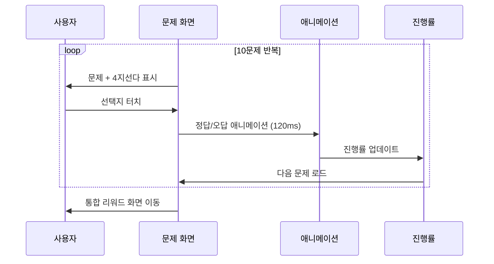
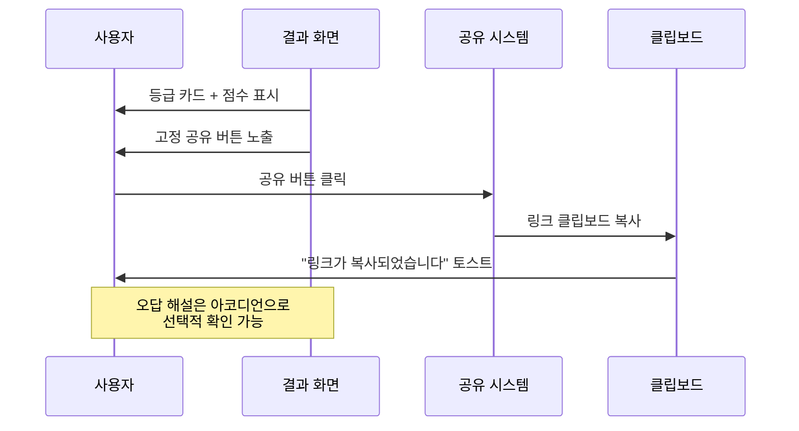

# UX 플로우 다이어그램 - 사용자 여정

**문서 버전:** 1.0  
**작성일:** 2025-07-11  
**작성자:** AI Development Team  
**참조:** PRD v5.2 섹션 2.3, STEP 1 기능 분류

---

## 📋 개요

FaceRead 감정 인식 퀴즈의 사용자 경험 흐름을 정의하고, PRD에서 선택한 "통합 리워드 화면" 방식을 구체화합니다.

---

## 🎯 핵심 UX 원칙

### 1. 간결한 플로우
- **3-Click Rule**: 퀴즈 시작부터 공유까지 최대 3번의 클릭
- **단일 페이지 전환**: 복잡한 네비게이션 없이 직관적 진행

### 2. 바이럴 최적화
- **즉시 공유 가능**: 결과 확인과 동시에 공유 버튼 노출
- **재도전 유도**: 결과 화면에서 바로 재시작 가능

### 3. 모바일 우선
- **터치 친화적**: 최소 44px 터치 영역
- **세로 스크롤 최소화**: 한 화면에 핵심 정보 배치

---

## 🚀 메인 플로우 다이어그램

---

## 📱 모바일 상세 플로우

### 1. 진입 및 온보딩

### 2. 퀴즈 진행

### 3. 결과 및 공유

---

## 🎨 화면별 상세 정의

### 1. 랜딩 페이지
**목표**: 첫인상 + 즉시 참여 유도
- **상단**: 광고 배너 (320×50)
- **헤로**: 제품명 + 간단한 설명
- **CTA**: "감정 읽기 테스트 시작" 버튼
- **미리보기**: 예시 문제 1개 표시

### 2. 닉네임 입력
**목표**: 개인화 + 검증
- **입력 필드**: 1-10자 실시간 검증
- **가이드**: "영문/한글/숫자만 가능" 안내
- **에러 처리**: 부적절한 입력 시 즉시 피드백

### 3. 모드 선택
**목표**: 사용자 선택권 제공
- **표준 모드**: 추천 배지 + 간단 설명
- **통합 모드**: 고급 사용자용 + 슬라이더 미리보기
- **예상 소요시간**: 각 모드별 "약 2-3분" 표시

### 4. 퀴즈 화면
**목표**: 몰입 + 명확한 피드백
- **상단**: 진행률 바 (1/10)
- **중앙**: 이미지 또는 텍스트 문제
- **하단**: 4지선다 버튼 (터치 영역 44px+)
- **애니메이션**: 선택 시 즉시 피드백

### 5. 통합 리워드 화면
**목표**: 만족감 + 공유 유도 + 재참여
- **최상단**: 광고 배너 (시각적 분리)
- **상단**: 결과 카드 (등급 + 점수)
- **중상단**: 공유 CTA 고정 버튼
- **중하단**: 오답 해설 아코디언
- **하단**: 재시작 버튼

---

## 📊 플로우 최적화 지표

### 완료율 목표
- **닉네임 입력 → 퀴즈 시작**: ≥ 90%
- **퀴즈 시작 → 완료**: ≥ 85%
- **완료 → 공유 클릭**: ≥ 15% (핵심 KPI)

### 시간 목표
- **랜딩 → 퀴즈 시작**: ≤ 30초
- **전체 퀴즈 완료**: 2-3분
- **결과 확인 → 공유**: ≤ 10초

### 이탈 지점 분석
1. **닉네임 입력**: 복잡한 규칙으로 인한 이탈
2. **문제 5번째**: 중간 지점 집중력 저하
3. **결과 화면**: 공유 의지 부족

---

## 🔄 개선 포인트

### A/B 테스트 대상
- [ ] 닉네임 입력 vs 익명 시작
- [ ] 진행률 표시 방식 (바 vs 숫자)
- [ ] 공유 버튼 문구 ("공유하기" vs "도전 보내기")
- [ ] 결과 카드 디자인 (미니멀 vs 화려함)

### 접근성 개선
- [ ] 스크린 리더 지원
- [ ] 키보드 네비게이션
- [ ] 고대비 모드 지원
- [ ] 큰 텍스트 모드 대응

---

**다음 단계**: 모바일 와이어프레임 상세 설계 